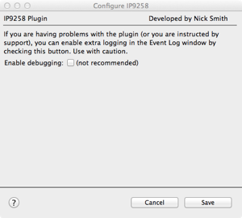
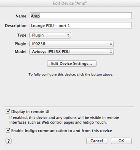
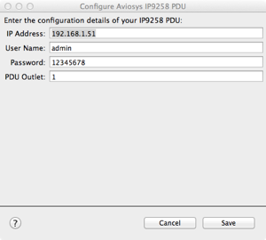

The [AVIOSYS IP9258](http://www.aviosys.com/9258.html) is a 4 outlet power distribution switch that allows individual outlets to be switched on &amp; off remotely via a wired Ethernet connection.
This plugin extends the [Indigo Domotics Indigo](http://www.indigodomo.com/index.html) Mac home automation application to support the IP9258 and allow each outlet to be configured and controlled
as a separate device. Models supporting UK, European &amp; US power outlets are available.

I’ve used these to replace X10 appliance modules where a number of devices need to be controlled within a small area (e.g. behind the TV) or where the devices being switched require a higher degree of reliability than can be achieved using X10.

## Installation

* Download the plugin bundle to the Mac running Indigo &amp; unzip it if necessary
* Double-click on the IP9258.indigoPlugin file: Indigo will ask if you would like to install it
* The plugin’s configuration screen will pop up. Just hit Save to carry on.

## Configuration

1) From within the Indigo Devices list, click “New” and create a device representing the first power outlet. In the example below, a hi-fi amplifier is connected to this outlet.

2) Click on the “Edit Device Settings” button to display the detailed configuration screen

The details are reasonably self-explanatory:

* IP address: IP address of the PDU. “192.168.1.100” is the default value
* Username: username used to log into the PDU. “admin” is the default value
* Password: password used to log into the PDU. “12345678” is the default value
* PDU outlet: the outlet you wish to control (1 - 4)

3) Enter the details relating to your IP9258 configuration &amp; press “Save” once complete.

4) Repeat for as many devices as required.

## Supported Operations

An outlet device will support the following operations:

* Turn on
* Turn off
* Toggle
* Get status

Indigo V5 or later is required.

## Release History

* V1.0 - 28 October 2012 Initial release
* V1.1 - 4 November 2012 Added code to maintain connection to improve performance
* V1.2 - 1 October 2013 Bug fixes
* V1.3 - 28 August 2016 Repackaged for Github distribution
* V1.4 - 13 January 2018 Repackaged for Indigo Plugin Library submission

[Back to Index](https://smudger4.github.io)
